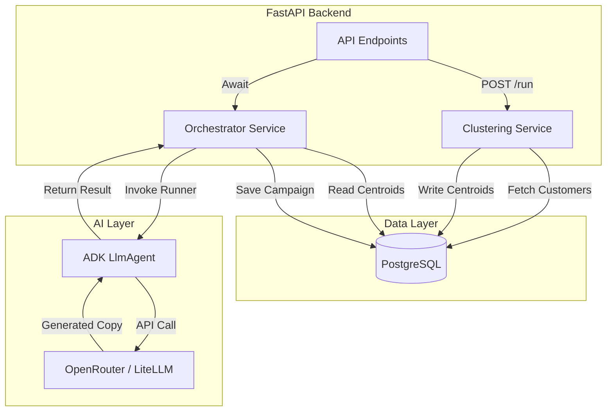
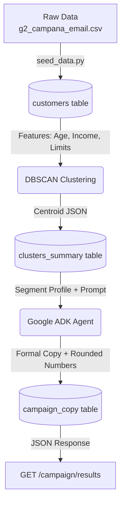

# Architecture Document: Smart Marketing Agent (ADK + DBSCAN + OpenRouter)

## 1. Product Overview & System Context
The system is an automated analytical and generative platform. It extracts customer data, applies unsupervised learning (DBSCAN) to find natural groupings without bias, and then uses a foundational model (LLM) orchestrated by **Google Agent Development Kit (ADK)** via the **OpenRouter** API to draft marketing copy (Next Best Offer) in Chilean Spanish.

## 2. Technology Stack
- **Language:** Python 3.11+ (`.venv` virtual environment). Apple Silicon (M3 ARM) compatible.
- **Backend Framework:** FastAPI (to provide an execution endpoint or control interface).
- **Database:** PostgreSQL (storage for customers, metrics, clusters, and generated texts).
- **Machine Learning:** `scikit-learn` (DBSCAN, StandardScaler), `pandas`.
- **Agent Framework:** Google ADK (`adk-python`).
- **LLM Provider Integration:** `LiteLlm` (provided by ADK) pointing to OpenRouter (`openrouter/...`).
- **Containerization:** Docker & Docker Compose (to orchestrate the DB, backend, and dependencies in isolation).

## 3. High-Level Architecture & Components

### 3.1. Data Layer (PostgreSQL)
- **`customers` table:** Stores raw and preprocessed customer data.
- **`clusters_summary` table:** Stores the centroid/profile of each cluster found by DBSCAN.
- **`campaign_copy` table:** Stores the generated text (NBO) from the agent for each cluster.

### 3.2. Clustering Service (Analytical)
- A deterministic Data Pipeline module in Python.
- **Flow:** Extracts data -> Scales (`StandardScaler`) -> Applies `DBSCAN(eps, min_samples)` -> Identifies clusters and noise (cluster `-1`) -> Calculates averages per cluster -> Saves to DB.

### 3.3. Agentic Layer (Google ADK)
- The Google ADK agent pattern is used to orchestrate the copywriting.
- **Copywriter Agent:**
  - Implemented as an ADK `LlmAgent`.
  - **Model:** `LiteLlm(model="openrouter/anthropic/claude-3.5-sonnet")` (or another model on OpenRouter).
  - **Instruction:** "You are a Chilean digital marketing expert. Based on the profile of this segment, write a persuasive and approachable 'Next Best Offer', using natural Chilean colloquialisms without exaggerating."
- **Orchestrator:** Iterates over the `clusters_summary` table and invokes the `Copywriter Agent`, passing the profile as context to the `session state` to get the resulting copy.

### 3.4. API & Orchestration (FastAPI)
- **Endpoint `POST /api/v1/campaign/run`**: Triggers the entire process asynchronously.
- Sequentially calls the Clustering Service and then delegates to the ADK Agentic Layer.

## 4. Environment & Secrets Management
A strict `.env` file (not committed) loaded via `pydantic-settings` or `python-dotenv` will be used:
```env
POSTGRES_USER=myuser
POSTGRES_PASSWORD=mypassword
POSTGRES_DB=marketing_db
OPENROUTER_API_KEY=sk-or-v1-xxxxxxxxxxxxxxxxx
```

## 5. Deployment & Docker
- **`Dockerfile`:** Multistage, based on `python:3.11-slim-bookworm` (ARM64 compatible). Installs dependencies from `requirements.txt` or via `uv`.
- **`docker-compose.yml`:** Spins up the FastAPI backend container and the PostgreSQL database in an internal network.

---

## 6. Reflective Audit

1. **Failure Point: DBSCAN tuning produces a single cluster or pure noise.**
   - *Mitigation:* Implement a post-clustering validation in the backend. If the noise ratio is > 30% or if there is only 1 cluster, the pipeline aborts, alerts the user, and does not unnecessarily consume OpenRouter tokens. A heuristic k-distance algorithm can be used to auto-tune the `eps` parameter.

2. **Failure Point: OpenRouter failures (Timeouts, Rate Limits, or specific model downtime).**
   - *Mitigation:* `LiteLlm` allows configuring automatic *fallbacks*. If the primary model fails, the ADK agent automatically routes to a secondary model. Additionally, exponential retries must be implemented in the agent invocation.

3. **Failure Point: LLM hallucinates non-existent offers or overdoes the Chilean Spanish (caricaturization).**
   - *Mitigation:* Incorporate a validation step in the ADK agentic layer. Create a `ReviewerAgent` in a `SequentialAgent` pipeline: the first agent drafts, and the second reviews if it includes products from a strict catalog and evaluates if the tone is professional.

---
**Clear answer:** Modular architecture defined using FastAPI, PostgreSQL, DBSCAN for deterministic clustering, and Google ADK orchestrating OpenRouter via `LiteLlm`.
**Confidence level:** High. All requested components and tools fit smoothly under this modern design pattern.
**Key caveats:** `scikit-learn` in Docker ARM (M3) environments occasionally requires C++ build dependencies. It is preferable to use binary distributions (wheels) installed via `uv` to avoid long compilation times. ADK is a recent framework; the official `google.adk` version must be used to ensure `LiteLlm` support.

---

## 7. System Diagrams

### 7.1. Module & Service Interactions


### 7.2. Input/Output Data Flow

