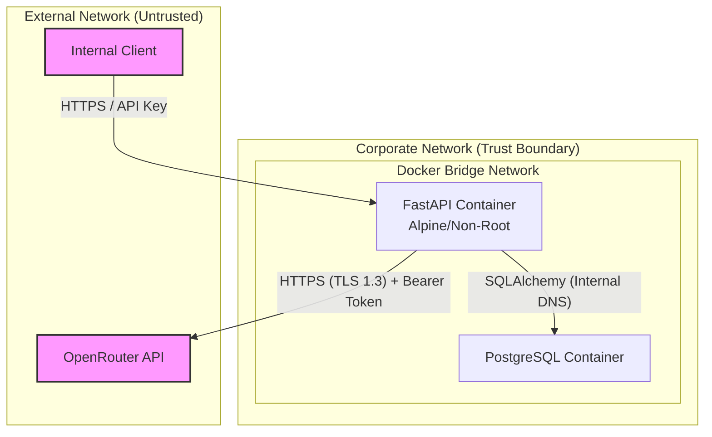

# Secure Tasks: Smart Marketing Agent (Security by Design)

## 1. Threat Model (Data Flow with Trust Boundaries)

## 2. Multi-Agent Security Assessment

### 2.1 Threat Modeling Agent (STRIDE)
- **Spoofing/Tampering:** Internal requests to FastAPI could be spoofed. **Mitigation:** Implement internal API Keys for the FastAPI endpoints to ensure only authorized internal services trigger the LLM.
- **Information Disclosure:** The `.env` containing `OPENROUTER_API_KEY` could be exposed. **Mitigation:** Exclude `.env` via `.gitignore` and `.dockerignore`. Load secrets securely at runtime.
- **Denial of Service:** LLM API rate limits and billing can be exhausted via API abuse. **Mitigation:** Implement strict rate limiting and an `X-API-Key` header on the FastAPI POST endpoint.

### 2.2 AppSec Engineer Agent
- **Container Security:** Default Python Docker images run as root. **Mitigation:** Build images using minimal base images (e.g., `python:3.11-alpine`) and map to a non-root user (`USER 1000:1000`).
- **Input Validation:** API endpoints currently lack strict schemas. **Mitigation:** Use Pydantic `BaseModel` and `BaseSettings` for strict environment and API input validation.

### 2.3 Identity & Access (IAM) Agent
- **API Authentication:** Since there is no formal IdP (Auth0, etc.), we must protect the internal connection. **Mitigation:** Implement a simple `X-API-Key` header validation in FastAPI via dependency injection.
- **Database Access:** PostgreSQL defaults. **Mitigation:** Adhere to the principle of least privilege. Continue using the restricted `marketing_user` instead of `postgres` root.

### 2.4 CISO Agent (Principal)
- **Priority 1:** Protect the `OPENROUTER_API_KEY` (OWASP A07:2021 - Identification and Authentication Failures).
- **Priority 2:** Ensure prompt boundaries are strict to prevent LLM manipulation or extraction (OWASP Top 10 for LLMs - Prompt Injection).
- **Verdict:** Approved to proceed with the updated Secure Tasks below. The toy nature of the dataset lowers PII risk, but API Key exhaustion risk remains high.

---

## 3. Secure Task Definitions

### Task 1: Secure Environment Setup and Database Schema
- **Security Risks:** Hardcoded database credentials; root execution in Docker.
- **Security Requirements:**
  - Create a non-root user in the `Dockerfile` (`USER appuser`).
  - Use `pydantic-settings` to strictly load and validate secrets. Add `.env` to `.gitignore`.
- **Definition of Done:** `docker-compose up` runs successfully with a non-root user. Pydantic throws an initialization error if `OPENROUTER_API_KEY` is missing.

### Task 2: Mock Data Generator
- **Security Risks:** Data poisoning during generation.
- **Security Requirements:**
  - Enforce schema validation (e.g., using a Pydantic model representation) before bulk insertion.
- **Definition of Done:** Script validates data types before hitting the database.

### Task 3: DBSCAN Clustering Service
- **Security Risks:** Memory exhaustion if data size is unconstrained.
- **Security Requirements:**
  - Implement a chunk limit or memory check before loading the entire `customers` table into memory with pandas.
- **Definition of Done:** Service limits SQL fetching to prevent container OOM (Out of Memory) crashes.

### Task 4: ADK & OpenRouter Agent Configuration
- **Security Risks:** Prompt Injection; Leaked API Keys in traceback logs.
- **Security Requirements:**
  - Never print or log the `OPENROUTER_API_KEY`.
  - Apply strict system instructions to prevent prompt injection or extraction of the underlying prompt.
- **Definition of Done:** Tests verify that missing API keys throw a clear, safe initialization error (fail-secure without leaking secrets).

### Task 5: Agent Orchestration and Validation
- **Security Risks:** Server-Side Request Forgery (SSRF) via OpenRouter or Timeout-induced DoS.
- **Security Requirements:**
  - Set strict timeout rules for HTTP requests to OpenRouter.
  - Implement exception handling for rate limits (HTTP 429) without revealing internal architecture in API error messages.
- **Definition of Done:** Orchestrator handles network timeouts and OpenRouter errors securely without crashing the server.

### Task 6: Secure FastAPI Endpoints and E2E Integration
- **Security Risks:** Unauthorized endpoint triggering leading to LLM billing exhaustion.
- **Security Requirements:**
  - Implement an `X-API-Key` dependency in FastAPI to restrict access to the POST/GET endpoints.
  - Enforce Pydantic validation on any future query parameters.
- **Definition of Done:** Unauthenticated calls return `401 Unauthorized`. Authenticated calls process correctly.
